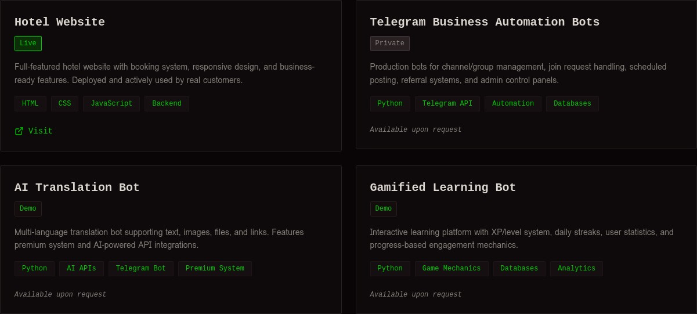
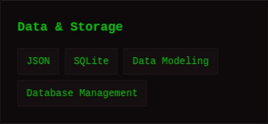
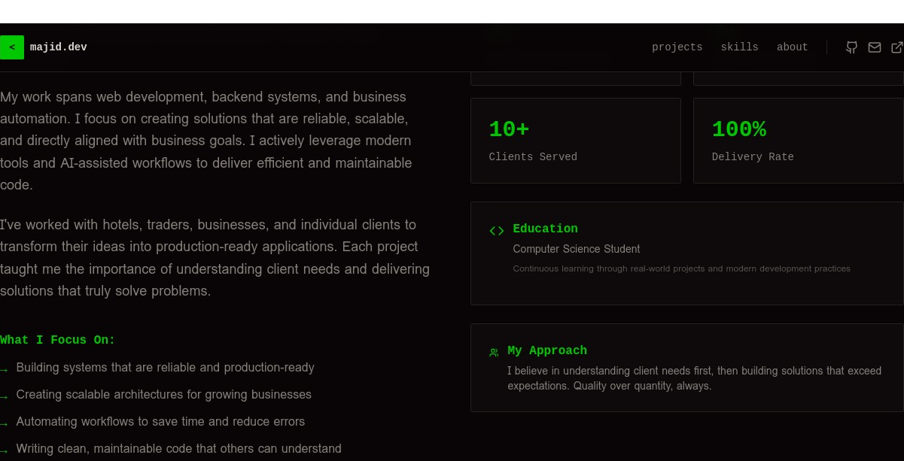

# Majid Al-Sakani | Professional Portfolio Website

<div align="center">


**A modern, technical portfolio showcasing production-ready projects and expertise in web development, backend systems, and business automation.**

[🌐 Live Demo](https://majid-alsakani.onrender.com/) • [📁 Repository](https://github.com/majid-alsakani/majid-portfolio) • [💼 Contact](mailto:majidalsakani@gmail.com)

</div>

---

## 🎯 Overview

This is a professional portfolio website built with **React 19**, **TypeScript**, and **Tailwind CSS 4**. The design follows a technical aesthetic inspired by code editors, featuring a dark theme with neon green accents.

**Live Site:** https://majid-alsakani.onrender.com/

### Key Features

- ✨ **Modern Technical Design** - Dark theme with neon green accents inspired by developer tools
- 📱 **Fully Responsive** - Optimized for all devices and screen sizes
- ⚡ **Fast Performance** - Built with Vite for instant development and optimized production builds
- 🎬 **Smooth Animations** - Powered by Framer Motion for elegant transitions
- 🎨 **Professional UI** - Built with shadcn/ui components and Tailwind CSS
- 📊 **Project Showcase** - Display of 4 real-world projects with detailed descriptions

---

## 📸 Screenshots

### Hero Section

*Main landing section with call-to-action buttons*

### Featured Projects

*Showcase of 4 production projects with technologies and status*

### Skills & Experience

*Comprehensive skills breakdown and personal information*

### Footer

*Contact information and quick navigation links*

---

## 🏗️ Project Structure

```
majid-portfolio/
├── client/
│   ├── src/
│   │   ├── components/          # Reusable UI components
│   │   │   ├── Navigation.tsx    # Header navigation
│   │   │   ├── HeroSection.tsx   # Main hero section
│   │   │   ├── ProjectsSection.tsx
│   │   │   ├── SkillsSection.tsx
│   │   │   ├── AboutSection.tsx
│   │   │   └── Footer.tsx
│   │   ├── pages/               # Page components
│   │   ├── contexts/            # React contexts
│   │   ├── hooks/               # Custom hooks
│   │   ├── lib/                 # Utility functions
│   │   ├── index.css            # Global styles & design tokens
│   │   ├── App.tsx              # Main app component
│   │   └── main.tsx             # Entry point
│   ├── public/                  # Static assets
│   └── index.html               # HTML template
├── server/
│   └── index.ts                 # Express server for production
├── package.json                 # Dependencies
├── vite.config.ts               # Vite configuration
├── tsconfig.json                # TypeScript configuration
├── render.yaml                  # Render deployment config
└── README.md                    # This file
```

---

## 🚀 Getting Started

### Prerequisites

- **Node.js** 18+ or higher
- **pnpm** (recommended) or npm

### Installation

1. **Clone the repository**
   ```bash
   git clone https://github.com/majid-alsakani/majid-portfolio.git
   cd majid-portfolio
   ```

2. **Install dependencies**
   ```bash
   pnpm install
   ```

3. **Start development server**
   ```bash
   pnpm dev
   ```
   The site will be available at `http://localhost:3000`

### Build for Production

```bash
pnpm build
```

This creates an optimized production build in the `dist/` directory.

### Start Production Server

```bash
pnpm start
```

---

## 🎨 Design System

### Color Palette

- **Primary Dark**: `#000000` - Main background
- **Neon Green**: `#00FF00` - Accent color for interactive elements
- **Light Gray**: `#E5E5E5` - Text and borders
- **Dark Gray**: `#1A1A1A` - Secondary background

### Typography

- **Display Font**: Bold, technical aesthetic
- **Body Font**: Clean, readable sans-serif
- **Hierarchy**: Clear visual distinction between headings and body text

### Design Philosophy

The design is inspired by code editors and developer tools, creating a professional yet approachable aesthetic that reflects the technical nature of the work.

---

## 📋 Sections

### 1. Navigation
- Quick links to all sections
- Social media links (GitHub, Email, Portfolio)
- Smooth scrolling navigation

### 2. Hero Section
- Eye-catching headline with technical styling
- Professional tagline
- Call-to-action buttons
- Code-inspired decorative elements

### 3. Featured Projects
**4 Real-World Projects:**

1. **Hotel Website** (Live)
   - Full-featured booking system
   - Responsive design
   - Production-ready

2. **Telegram Business Automation Bots** (Private)
   - Channel/group management
   - Scheduling systems
   - Admin dashboards

3. **AI Translation Bot** (Demo)
   - Multi-language support
   - Premium system
   - AI-powered integrations

4. **Gamified Learning Bot** (Demo)
   - XP/level system
   - User statistics
   - Engagement mechanics

### 4. Skills & Technologies

**Languages:** Python, JavaScript, HTML/CSS, TypeScript

**Web & Backend:** REST APIs, Backend Architecture, Responsive Design, Database Design

**Automation & Bots:** Telegram Bot Dev, Business Automation, Scheduling Systems, Admin Dashboards

**Tools & Platforms:** Git/GitHub, Linux, APIs, AI-assisted Development

**Data & Storage:** JSON, SQLite, Data Modeling, Database Management

**Specializations:** Scalable Systems, Business Logic, User Management, Role-based Access

### 5. About Section
- Professional background
- Key statistics (4+ projects, 2+ years experience, 10+ clients, 100% delivery rate)
- Education information
- Personal approach and philosophy

### 6. Footer
- Contact information
- Quick navigation links
- Social media links
- Copyright notice

---

## 🛠️ Technology Stack

### Frontend
- **React 19** - UI framework
- **TypeScript** - Type safety
- **Tailwind CSS 4** - Utility-first styling
- **Vite** - Build tool and dev server
- **Framer Motion** - Animation library
- **shadcn/ui** - Component library
- **Wouter** - Client-side routing

### Backend
- **Express.js** - Web server
- **Node.js** - Runtime environment

### Deployment
- **Render** - Hosting platform
- **GitHub** - Version control and CI/CD

---

## 📦 Dependencies

### Key Dependencies
- `react@^19.2.1` - UI framework
- `framer-motion@^12.23.22` - Animations
- `tailwindcss@^4.1.14` - Styling
- `lucide-react@^0.453.0` - Icons
- `wouter@^3.3.5` - Routing
- `express@^4.21.2` - Server

### Dev Dependencies
- `vite@^7.1.7` - Build tool
- `typescript@5.6.3` - Type checking
- `tailwindcss-animate@^1.0.7` - Animation utilities

---

## 🚀 Deployment

### Render Deployment

The project is configured for easy deployment on Render using the `render.yaml` file.

**Steps:**
1. Push code to GitHub
2. Connect repository to Render
3. Render automatically builds and deploys on every push

**Live URL:** https://majid-alsakani.onrender.com/

### Environment Variables

- `NODE_ENV` - Set to `production` for production builds
- `PORT` - Server port (default: 3000)

---

## 📝 Development Workflow

### Running Locally

```bash
# Install dependencies
pnpm install

# Start dev server
pnpm dev

# Build for production
pnpm build

# Start production server
pnpm start

# Format code
pnpm format

# Type check
pnpm check
```

### Code Quality

- **TypeScript** - Full type safety
- **Prettier** - Code formatting
- **ESLint** - Code linting (configured via Tailwind)

---

## 🎯 Key Features Explained

### Technical Design Aesthetic
The portfolio uses a dark theme with neon green accents, inspired by code editors. This creates a professional yet distinctive appearance that reflects the technical nature of the work.

### Responsive Design
Built mobile-first with Tailwind CSS, ensuring the portfolio looks great on all devices from mobile phones to large desktop monitors.

### Performance Optimized
- Vite for fast development and optimized builds
- Code splitting for efficient loading
- Optimized images and assets
- Server-side rendering for production

### Smooth Animations
Framer Motion provides subtle animations that enhance the user experience without being distracting:
- Fade-in effects on scroll
- Smooth transitions between sections
- Interactive button states
- Hover effects

---

## 📞 Contact

- **Email:** majidalsakani@gmail.com
- **GitHub:** https://github.com/majid-alsakani
- **Portfolio:** https://majid-alsakani.onrender.com/

---

## 📄 License

This project is licensed under the MIT License - see the LICENSE file for details.

---

## 🙏 Acknowledgments

- Built with [React](https://react.dev/)
- Styled with [Tailwind CSS](https://tailwindcss.com/)
- Animated with [Framer Motion](https://www.framer.com/motion/)
- Components from [shadcn/ui](https://ui.shadcn.com/)
- Deployed on [Render](https://render.com/)

---

<div align="center">

**Made with ❤️ by Majid Al-Sakani**

[Visit Live Site](https://majid-alsakani.onrender.com/) • [View on GitHub](https://github.com/majid-alsakani/majid-portfolio)

</div>
